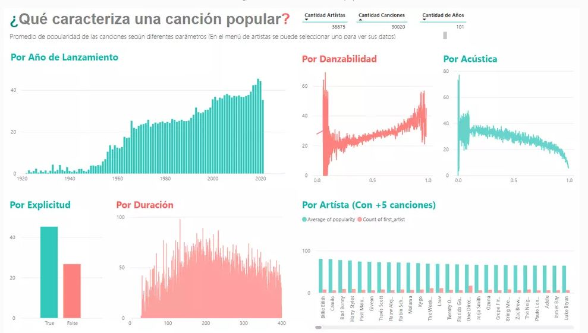
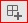
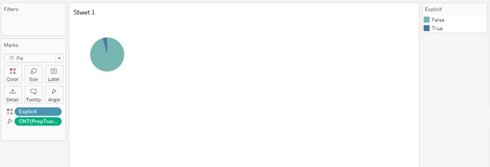

# Práctica 1: - Visualización y exploración de datos

## Objetivos

- Manipular herramientas para generar tableros de control con el fin de realizar un prototipo para una organización
- Explorar una fuente de datos de formato "csv" para entenderla e identificar posibles problemas de calidad de datos

## Herramientas

Durante esta práctica trabajaremos con las siguientes herramientas: 

- Tableau Desktop 

- Microsoft PowerBI 

## Antes de iniciar
- Instalar de forma local Tableau (https://www.tableau.com/academic/students). Mayor nivel de detalle en la sección de Tableau de esta práctica.
- Instalar localmente (https://powerbi.microsoft.com/es-es/downloads/) 
	o acceder a PowerBI en la Web. Mayor nivel de detalle en la sección de PowerBI de esta práctica.
- Descargar los [datos](datos/2023/Datos_BiciAlpesPerfilamiento.csv) a utilizar en la práctica
- Descargar el [diccionario de datos](datos/2023/Diccionario_BiciAlpes.xlsx)
- Descargar el [logo](img/EncabezadoIN.JPG) del curso

## Descripción del caso

BiciAlpes es una organización que presta un servicio de alquiler de bicicletas, solidario y 
con muchos beneficios para los usuarios. Su objetivo es incentivar planes de movilidad 
sostenible en zonas urbanas, que contribuyan a reducir la emisión de gases de efecto invernadero que afectan la temperatura del planeta.

BiciAlpes ha contratado su empresa y quiere iniciar esta consultoría, identificando la capacidad que tienen algunas  herramientas del mercado para generar tableros de control, en particular PowerBI y Tableau. 
Es así como quiere que usted genere un primer prototipo de tablero de control, utilizando alguna de esas herramientas y le brinde retroalimentación que pueda utilizar para seleccionar la herramienta a utilizar en análisis posteriores. 

La empresa espera como entregable: Un primer prototipo de tablero de control, que cumpla con una serie de lineamientos que está diseñando para construir ese estilo de aplicaciones. 
Ese primer prototipo debe:
1. Permitirles explorar rápidamente una serie de datos, en particular los relacionados con [información de accidentes](datos/Datos_BiciAlpesPerfilamiento.csv), y las preguntas de interés de BiciAlpes, 
2. Describir la empresa a partir de los datos y dar ejemplos de oportunidades que tendrá al usar analítica. 

## Ejemplos de resultados esperados
En la guía se presente una forma de visualizar lo solicitado en la práctica utilizando datos de canciones, diferentes a los compartidos.
De igual manera utilizan diferentes tipos de gráficas que ustedes pueden cambiar para que sea más claro lo que presentan y por supuesto más fácil de utilizar en diferentes proyectos.
A continuación encuentran ejemplos de resultados de esta práctica realizada por estudiantes en semestres anteriores, para la empresa de SpotiAlpes.

## Instrucciones 

Esta práctica tiene dos partes principales para la exploración de dos herramientas diferentes que pueden ser utilizadas en un contexto real para la creación de tableros de control: Microsoft PowerBI y Tableau Desktop. 

#### Microsoft Power BI 

##### Instalación de la herramienta

Para poder utilizar Power BI desktop, herramienta a la que tiene acceso gratuito con la licencia de Microsoft disponible por su cuenta universitaria de Uniandes, lo primero que necesita es descargar el software desde este sitio web: https://powerbi.microsoft.com/es-es/downloads/. 
Es posible que primero deba iniciar sesión con su cuenta Microsoft institucional para poder descargarlo correctamente.  

Si tiene Mac, diríjase al siguiente enlace y seleccione descargar en la sección “Microsoft Power BI Desktop”: https://powerbi.microsoft.com/en-us/downloads/. 

Ejecute la aplicación Microsoft Store. Allí, busque Power BI Desktop. Seleccione “Obtener/Descargar”.

Cuando termine la instalación, ejecútelo y, de ser necesario, inicie sesión con su cuenta uniandes.

##### Conexión a la fuente de datos
Al ejecutar PowerBI, se encontrará con una pantalla similar a la siguiente. Allí, debe seleccionar la opción “Obtener datos”.

En este punto le debe aparecer una ventana emergente. Allí, debe seleccionar el tipo de datos a los que quiere acceder. En este caso, al ser un archivo de extensión csv, deberá seleccionar la opción respectiva. 

Luego, aparecerá otra ventana emergente, donde debe buscar la ubicación del archivo de datos respectivo para esta práctica.  

Una vez seleccionado el archivo csv, aparecerá un preview de los datos que quiere importar. Allí, PowerBI le mostrará cómo se importarán los datos, basado en las primeras 200 filas del archivo.  

Recuerde cambiar en esta ventana el campo de origen del archivo a la opción “UTF-8” (la decodificación que usará el programa  para el manejo adecuado de tildes y "eñes"), en caso de que otra opción este allí seleccionada. Tal campo lo encontrará en la esquina superior izquierda. En caso de ser necesario, modifique también el campo “Delimitador” a la opción “Coma”.  

No oprima “Cargar” aún. 

##### Exploración de la fuente de datos

Un primer avance para la exploración y análisis de la calidad de datos puede comenzar ahora. Seleccione “Transformar datos” en esta ventana. A continuación, debe aparecer otra ventana como la que se muestra a continuación.  

Esta herramienta, llamada Power Query, le permitirá realizar transformaciones a sus datos para ajustar sus atributos, y así realizar una exploración y limpieza de los datos. Podrá cambiar el tipo de columna, realizar reemplazos de datos faltantes o de errores, entre otros. Por ahora, solo nos centraremos en realizar una exploración previa de éstos.  

Seleccione “Vista” en la parte superior, y allí habilite las opciones “Calidad de columnas” y “Distribución de columnas”. La vista de la ventana ahora debería ser la que se muestra a continuación. Explore las diferentes estadísticas que ahora se muestran de cada una de las columnas, donde podrá darle una primera vista a la calidad de los datos y su distribución. 

Es muy **importante**, a la hora de hacer el análisis y exploración de datos, que usted se asegure de conocer las distribuciones y número de columnas, su tipo de valor (numérico, booleano, etc.) y su porcentaje de valores válidos, erróneos y/o vacíos. De esta manera, usted puede generar conocimiento con más facilidad. Con este análisis, determinará si los datos necesitan ser transformados o requieren algún tipo de limpieza para lograr el objetivo propuesto. Cuando termine de explorar, seleccione “Inicio” y luego “Cerrar y Aplicar”. 

##### Creación del tablero de control y visualizaciones

Espere unos segundos a que el programa procese los datos. Luego se encontrará con una pantalla como la siguiente, donde tendrá un lienzo nuevo. Si se fija, en la parte derecha de su pantalla tiene la tabla con los campos (columnas) que acaba de importar.

Los reportes y tableros de control son altamente modificables. Pueden ser personalizados con imágenes y logos, para darles sentidos institucionales. Seleccione “Insertar” y luego “Imagen” en la parte superior. Añada el [logo](img/EncabezadoIN.JPG) del curso, como se muestra a continuación. Añada también un cuadro de texto donde se aclare la atención o el propósito del tablero de control.

Ahora ya es posible empezar el análisis de los datos. Primero se añadirá un contador de cuántas filas hay en nuestro archivo. Para ello, desde Visualizaciones, añada la visualización tipo Tarjeta.

Arrastre desde la columna de “Campos” el “id” hasta la columna “Visualizaciones” (teniendo seleccionada la visualización que acaba de insertar). Allí cambie el tipo del campo que acaba de arrastrar de “Primero” a “Recuento”. 

Ajuste el tamaño de la visualización. Ahora, su lienzo debería verse como se muestra a continuación. De esta manera, su tablero le está mostrando cuántas filas hay en su tabla de datos. En nuestro caso, su tablero debería mostrar el valor 100 mil.

##### Columnas derivadas
Ahora, se desea revisar cuántas filas tienen un ID faltante. Para ello, se creará una medida. Las medidas resultan muy útiles si se desea realizar cálculos sobre los datos que se importaron. Para ello, seleccione en la parte superior derecha el botón “Nueva medida”.

Saldrá en la parte superior un cuadro donde se le permitirá escribir la medida que desea. Esto se realiza en un lenguaje denominado DAX. Para revisar cuántas filas tienen un ID vacío, incluya la siguiente formula: 

 

ID Faltantes = COUNTBLANK(PrepTracks[id]) 

 

Si desea conocer cuántos vacíos hay en otra columna, solo debe cambiar la información contenida en la fórmula entre “[]” y el nombre respectivo de la medida (lo que precede al “=”). 

Cuando finalice, su nueva medida la podrá encontrar en la columna de “Campos”. Añada otra visualización de tipo Tarjeta (como en pasos previos), con esta nueva medida. 

Cree una nueva medida. Esta vez, deseamos conocer el porcentaje del total de ID que son vacíos. Para ello, use la siguiente formula: 

 

% ID faltantes = [ID Faltantes]/COUNTA(PrepTracks[id]) 

Si tienes problema con el valor que está mostrando esta medida, asegúrate que al crear la medida el formato que le das es porcentaje.

Use esta nueva medida para añadir otra visualización tipo tarjeta. Su lienzo debería verse similar al siguiente: 

Nota: Si le aparece en ceros el % de Id faltantes, puede ser un tema de formato. Seleccione este campo y luego, en la pestaña "Formato", indique que este valor es porcentual.

A continuación, puede incluir otras visualizaciones interesantes. Añada la visualización “Gráfico circular”. 

Arrastre el campo “explicit” tanto a la sección “Leyenda” como a “Valores”. 

El resultado debe ser la siguiente visualización: 

**RETO:**

Intente añadir otras dos visualizaciones.  

Una de tipo tarjeta que muestre el número de columnas en la tabla.  

La segunda, una visualización de tipo gráfico de barras agrupadas, que muestre la popularidad por artista principal.  

Organice las visualizaciones de manera organizada y cambie el nombre de la página en la parte inferior. Explore las diferentes visualizaciones que le ofrece la herramienta. A continuación, se muestra un ejemplo: 

##### Enlaces de interés

Preparar datos en Power BI: https://docs.microsoft.com/en-us/learn/paths/prepare-data-power-bi/ 

Modelar en Power BI: https://docs.microsoft.com/en-us/learn/paths/model-power-bi/ 

Visualizar datos en Power BI: https://docs.microsoft.com/en-us/learn/paths/visualize-data-power-bi/ 

Análisis de datos en Power BI: https://docs.microsoft.com/en-us/learn/paths/perform-analytics-power-bi/ 

#### Tableau Desktop 

##### Instalación de la herramienta

Para poder utilizar Tableau Desktop se debe hacer la solicitud de la licencia de un año que se puede obtener con el registro como estudiante. Para ello diríjase a la siguiente página: https://www.tableau.com/academic/students 

En la esquina superior derecha, encontrará el botón “Free Student License”. Presione el botón y llene los datos necesarios para pedir la licencia, asegurándose de poner su correo uniandes como correo electrónico y de elegir la Universidad correctamente como se muestra en la siguiente imagen: 

 

A continuación, Tableau va a pedirle que suba un documento para comprobar que hace parte de la universidad. Para ello, puede enviar el certificado de calificaciones del último semestre que llegó a su correo o una foto de su carné. Luego de enviar el archivo, debe esperar el correo de Tableau con la información de su licencia que llegará en unas pocas horas. Si quiere empezar ahora mismo, mientras le asignan la licencia educativa, puede dar clic a “Download the 14 day trial here” en la pantalla que sale luego de enviar los documentos (ver captura a continuación). 

Al seleccionar esta opción, se descargará el instalador de Tableau. Instálelo desde el .dmg (MacOS) o desde el .exe (Windows). En el caso de MacOS puede utilizar este [enlace](https://kb.tableau.com/articles/Issue/unable-to-launch-or-install-tableau-desktop-on-mac) para descargar el instalador.

Luego de instalarlo, ábralo. Se encontrará con una pantalla en la que tiene dos opciones: si no ha recibido el correo de confirmación de Tableau debe volver a ingresar los datos solicitados (ver captura a continuación). Si ya recibió un correo con su clave de activación, haga clic en Activate Tableau elija la opción de activar con una clave de producto y digite la clave de activación que debió llegar al correo que registró en los pasos anteriores. 

Luego de llenar los datos, presione el botón “Start trial now”. Su cuenta de prueba se creará correctamente y Tableau le mostrará la pantalla de inicio. 

  

##### Conexión a la fuente de datos

Una vez allí, en la barra de la izquierda, en la sección “To a File” seleccione la opción de PostgreSQL. Si no aparece directamente, seleccione la opción “More...” y el archivo de interés (ver capturas a continuación). 

Si ha introducido todo correctamente, debería llegar a la pantalla que encuentra a continuación.  

##### Exploración de la fuente de datos
Con exploración de la fuente de datos nos referimos a obtener un conocimiento preliminar de cómo está conformada. Lo anterior puede incluir la cantidad de registros, cantidad de valores faltantes por columna, cantidad de columnas, tipos de datos correctos y cantidad de valores únicos. 

Actualmente, la herramienta de Tableau Desktop no permite realizar esta exploración de manera tan sencilla. Sin embargo, la licencia que ustedes obtienen tiene acceso a Tableau Prep que les permite explorar la fuente de datos de manera sencilla. 

I. Tableau Desktop 

Para hallar la cantidad de registros se siguen los siguientes pasos: 

 1) Crear una nueva hoja con el botón New Sheet     

 2) Arrastre la medida PrepTracks.csv(Count) del panel de datos hasta el campo Label de la tarjeta Marks 

 3) Cambiar las propiedades del texto para que se vea más atractivo visualmente seleccionando los 3 puntos del campo Label 

  

 4) Seleccionar con el clic derecho la hoja en donde se manejó la vista. 

 5) Seleccionar la opción Rename 

 6) Cambiar el título de la hoja según la vista creada. 

Para hallar la cantidad de registros con valores faltantes por columna se siguen los siguientes pasos: 

1) Repetir pasos 1 y 2 del proceso inmediatamente anterior. 

2) Arrastre la columna que desea explorar a la tarjeta Filters, en este caso la dimensión Id 

3) En la ventana emergente, seleccione la pestaña Condition 

4) Seleccione la opción By Formula e inserte la siguiente formula ISNULL([Id]), el campo Id en la formula se reemplaza según la columna a analizar 

5) Repetir los pasos 3,4,5 y 6 del proceso inmediatamente anterior 

De igual manera, es posible saber los tipos de datos en la pestaña Data Source justo encima del nombre de cada columna 

II. Tableau Prep 

Para hacer uso de Tableau Prep se debe descargar la aplicación por uno de los enlaces que son enviados al correo cuando se obtiene la licencia de Tableau Desktop. Una vez descargada la aplicación se puede comenzar a usar para explorar los datos siguiendo los pasos descritos a continuación: 

1) Abrir aplicación 

2) Seleccionar opción Connect to Data 

3) Seleccionar opción Text File del menú que aparece a la derecha 

4) Seleccionar el archivo .csv manejado en esta práctica 

La siguiente pantalla se debe poder visualizar 

5) Seleccionar el botón  

6) Seleccionar Clean Step 

	

Una vez se termina de desarrollar el paso de limpieza se llega a la siguiente pantalla: 

En el panel inferior de la pantalla es posible ver un perfilamiento general de la fuente de datos (1) y una muestra de estos (2). En el perfilamiento se puede ver la cantidad de columnas y filas en la parte superior izquierda del panel (3). En adición, al pasar el mouse por encima del nombre de las columnas aparece un mensaje con la cantidad de valores únicos de la columna (4). De igual manera, si se encuentran valores nulos al pasar el mouse por encima de este valor indica cuantos son y que porcentaje de la fuente de datos representan (5). 
Por último, para las variables con valor numérico es posible visualizar una gráfica con la distribución de sus valores (6) y los tipos de datos de cada variable se pueden ver encima de su nombre (7). 
	

##### Creación del tablero de control y visualizaciones
Para la creación del tablero de control, la empresa le ha pedido que siga las siguientes especificaciones: 

* Manejar el logo de la empresa y los colores asociados a la organización 

* Si se manejan visualizaciones con ejes, estos deben estar debidamente nombrados 

* Todas las hojas usadas deben tener un nombre representativo de la visualización que se encuentra en esta. 

Con el propósito de realizar estas visualizaciones y el tablero de control, inicialmente se deben seguir los siguientes pasos: 

i) Visualizaciones: Una vista es una visualización que se crea en Tableau. Una visualización puede ser un cuadro, un gráfico, un mapa, un trazado o incluso una tabla de texto. 

a. Crear una nueva hoja con el botón New Sheet 

b. Arrastre la medida Release Year del panel de datos hasta el estante de Columns 

c. Arrastre la medida PrepTracks.csv(Count) del panel de datos hasta el estante de Rows 

	 

d. Lo anterior genera automáticamente una vista, el estilo de esta puede ser cambiado seleccionando alguna de las opciones que no están de color gris en el botón Show More.  
	En este caso, se va a dejar la vista default elegida por Tableau. 
	En la vista es posible ver que nos advierte de un valor nulo, para manejar este valor faltante se puede crear un nuevo filtro. 

e. Arrastrar la medida Release Date a la tarjeta Filters 

f. En la ventana emergente, seleccionar el campo Null  y el campo Exclude. Realizando esto, se estarán excluyendo todos los registros que en el campo Release Date no tenían ningún valor. 
	

	
Para cumplir las indicaciones dadas por el cliente se debe cambiar el nombre de la hoja y de los ejes. 

g. Seleccionar el eje al cual se le desea cambiar el nombre y dar clic derecho. 

h. Seleccionar la opción Edit axis. 

	

i.	En la ventana emergente cambiar el título de manera acorde a la vista realizada. 

j. Seleccionar con el clic derecho la hoja en donde se manejó la vista. 

k. Seleccionar la opción Rename 

l. Cambiar el titulo de la hoja según la vista creada. 

Cabe resaltar que cada vista se crea de manera distinta. Cada vez que se arrastre un campo a la vista o a un estante, se estará haciendo una pregunta sobre los datos. La pregunta variará en función de dónde se arrastren los distintos campos, los tipos de campo y el orden en el que arrastre los campos en la vista. Para cada pregunta que realice, la vista cambia para representar la respuesta visualmente, con marcas (formas, texto, jerarquías, estructuras de tablas, ejes, color) [1]. 

A continuación, se va a crear otra vista para poder entender de mejor manera cómo funciona la herramienta siguiendo los siguientes pasos. En este caso no vamos a usar los estantes de Rows y Columns sino que se va a hacer uso de la tarjeta Marks que permite en ciertas ocasiones dar mayor profundidad en los análisis[1]. 

a) Crear una nueva hoja con el botón New Sheet 

b) En el menú desplegable de la tarjeta Marks seleccionar la opción pie. Lo anterior hace que el campo Angle sea visible 

c) Arrastrar la medida PrepTracks.csv(Count) del panel de datos hasta el campo Angle 
    

d) Arrastrar la dimensión Explicit hasta el campo Color 

Los anteriores pasos deben haber generado el resultado que se muestra en la siguiente imagen, aunque esta visualización es suficiente se puede crear algo mucho más detallado. 

e) Arrastrar la medida PrepTracks.csv(Count) del panel de datos hasta el campo Label 

f) Arrastrar la dimensión Explicit hasta el campo Label  

Los pasos e y f nos permiten añadir etiquetas a los datos que se muestran en el gráfico de pastel. 

g) El formato de las etiquetas de gráfico puede ser editado seleccionando del menú desplegable del label del campo la opción Format 

También es posible cambiar la cantidad que muestra en la etiqueta. 

h) Seleccionar el menú desplegable de el label del campo PrepTracks.csv(Count). 

i) Seleccionar la opción Quick Table Calculation 

j) Elegir la opción de la cantidad que se desea mostrar. 

k) Cambiar los colores del gráfico para cumplir las especificaciones de la empresa seleccionando el campo color y la opción Edit Colors 

l) Cambiar el nombre de la hoja de acuerdo con la vista creada 

**RETOS:**

Crear un gráfico de dona que muestre la misma información que la vista del gráfico de pastel 

Crear 2 vistas nuevas que reflejen información que usted considera pueden ser de valor para el negocio. 

ii) Tablero de control 

a) Crear un nuevo tablero de control seleccionando el botón New Dashboard     

Para añadir secciones a un tablero de control solo es necesario arrastrar alguno de los objetos o hojas del panel izquierdo y soltarlo en el lienzo. 

Se va a comenzar añadiendo una imagen del logo de la organización, el ejemplo se realiza con el [logo](img/EncabezadoIN.JPG) del curso pero usted debe añadir la imagen de la empresa que lo contrato. 

b) Arrastrar el objeto Image hasta el panel blanco. 

c) Seleccionar el archivo de la imagen 

d) Seleccionar opciones para insertar la imagen 

e) Seleccionar los botones Apply y OK

Ahora se va a insertar un título correspondiente a la información que el tablero de control va a manejar. 

f) Arrastrar el objeto Text en la sección del tablero de control 

g) Soltar el objeto en el lugar que usted considere conveniente, los lugares posibles se van a sombrear con gris a medida que usted mueva el mouse con el objeto en el espacio del tablero de control 

h) En la ventana emergente escribir el texto que desea insertar en el tablero de control y cambie el formato de ser necesario. 

i) Añadir las distintas hojas que se han creado de la misma manera que se añadió el texto y la imagen. 

j) Al añadir cada uno de los objetos o hojas se pueden cambiar distintos aspectos visuales de estos seleccionando el menú desplegable y la opción de cambio a realizar.

k) De igual manera, el tamaño del objeto se puede cambiar al seleccionar los bordes del objeto o hoja. 

l) Para cambiar la ubicación de alguno de los objetos o hojas en el tablero de control se debe seleccionar la parte superior del objeto y moverlo según se desee.

m) Cambiar nombre de la nueva pestaña, puede ser el mismo título.

Al finalizar, se debería tener un tablero de control similar al siguiente con los colores de la empresa que lo contrato y las distintas visualizaciones que usted creó.

##### Columnas derivadas
En ocasiones es de utilidad crear nuevas columnas que contengan cálculos sobre otras columnas y con estas columnas calculadas realizar las vistas. 

Para realizar nuevas columnas calculadas se realizan los siguientes pasos: 

1) Ir a la pestaña Data Source 

2) Seleccionar la columna sobre la cual se quiere realizar el cálculo. 

3) Seleccionar el botón que abre el menú desplegable 

4) En el menú desplegable seleccionar la opción Create Calculated Field

5) En la ventana emergente insertar el nombre de la nueva columna y la fórmula que se va a usar para calcularla. En este caso, se está creando una columna que indique si el Id del registro está faltando.
6) Verificar que la fórmula es válida y dar clic en Apply. 

Otras columnas derivadas que podrían ser útil para el análisis son la separación de las partes de la fecha de lanzamiento de una canción. 

1) Seleccionar la columna New Release Date 

2) Crear una nueva columna calculada desde este campo

3) Encontrar el mes y el día de lanzamiento. No es necesario calcular el año de lanzamiento ya que ya existe un campo para esto

Es posible observar que las columnas calculadas se diferencian de las columnas del Data Source ya que el tipo siempre es precedido por un símbolo igual y no tienen el borde superior azul. 

Haciendo uso de las columnas calculadas se pueden crear nuevas vistas que detallan a mayor profundidad la fuente de datos como pueden ser las siguientes: 

 
 
##### Enlaces de interés
[1] Tableau, «Ayuda de Tableau Desktop y de la creación web,» [En línea]. Available: https://help.tableau.com/current/pro/desktop/es-es/getstarted_buildmanual_ex1basic.htm. [Último acceso: 17 08 2021]. 

https://www.analyticsvidhya.com/blog/2021/02/how-to-create-donut-chart-tableau/ 

https://www.tableau.com/learn/get-started 

https://help.tableau.com/current/guides/get-started-tutorial/en-us/get-started-tutorial-home.htm 

https://help.tableau.com/current/pro/desktop/es-es/datafields_typesandroles.htm 

https://help.tableau.com/current/prep/en-gb/prep_explore.htm 

https://community.fabric.microsoft.com/t5/Desktop/Count-the-total-amount-of-columns-in-a-table-with-a-measure/m-p/844312#M405407

#### Para finalizar

Después de realizar la práctica, encuentre un compañero que haya usado una herramienta distinta a la que usted usó. Comparta en el padlet asociado a esta actividad sus experiencias, las diferencias, ventajas, y desventajas que encontraron en las dos herramientas. De igual manera si tiene dudas sobre el manejo de estas herramientas puede ponerlas en ese padlet. 
Las instrucciones detalladas están en la descripción del Padlet.

Para encontrar pareja, registre su información y contacte directamente a sus compañeros: [Tabla Parejas](https://docs.google.com/spreadsheets/d/11tulyA1_UHvmBc2vFvRc2KPtvSnH-s_p98HXgg-gjh8/edit?usp=sharing) 
Puede ser cualquier persona, incluyendo estudiantes de otras secciones.

